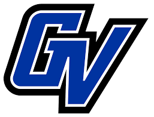

<h1>CIS350 - Wasted </h1>

<figure>
 </img>
</figure>

Made by: Katie Creech, Jared Currie

<h1>1. Abstract</h1>
An estimated 931 million tons of food goes to waste every year. This is an increasing problem as it becomes more expensive as production costs increase and space decreases. Landfills are also increasing the amount of methane gas released into the air. Most people don’t realize that this is an increasing problem. It’s hard to keep track of the life span of your food in everyday life. To combat this problem our team has created a website-“Wasted” to help the average person combat food waste. The user will be able to make an account and type what food they have in their fridge. Our website will then notify them when their food is about to go bad. This will help the average person combat food waste while also saving them money.

<h1>2. Introduction</h1>

This is a group project with the goal to create a fullstack web application. Learning the software development process as we work on the project. The name of our project is Wasted. The goal of our web based application is to eliminate at home food waste. We will do this by alerting people when certain items are close to expiring. The almost automatic reminder that an item is expiring will help food waste decrease for those that use our website.

<h1>3. Architectural Design</h1>

<h1>4. Class Diagram</h1>

<h1>5. UI Design</h1>
