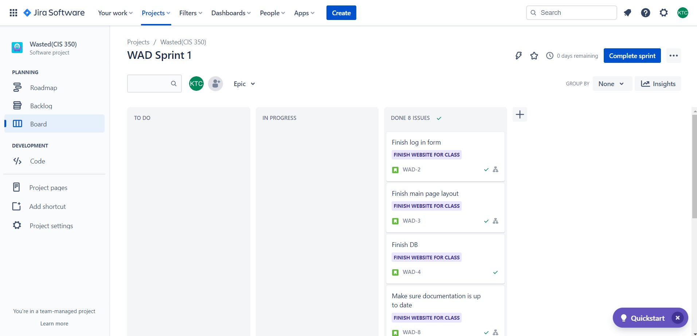

<h1>CIS350 - Wasted </h1>

<figure>
 </img>
</figure>

Made by: Katie Creech, Jared Currie

<h1>1. Abstract</h1>
An estimated 931 million tons of food goes to waste every year. This is an increasing problem as it becomes more expensive as production costs increase and space decreases. Landfills are also increasing the amount of methane gas released into the air. Most people don’t realize that this is an increasing problem. It’s hard to keep track of the life span of your food in everyday life. To combat this problem our team has created a website-“Wasted” to help the average person combat food waste. The user will be able to make an account and type what food they have in their fridge. Our website will then notify them when their food is about to go bad. This will help the average person combat food waste while also saving them money.

<h1>2. Introduction</h1>
 
 A website is a group of related webpages located under a single domain name, typically produced by a single person or organization. Food waste is becoming an increasing problem that not many people know about. Food waste is increasing at an alarming rate which is costing everyone money while also destroying the environment. A simple website could be the key to solving this epidemic. With this website the  average person can help combat the food waste epidemic while also saving themselves money. This website-“Wasted” is expected to provide a simple and efficient way to track your food’s average life span. Once the user goes into the website they will be asked to register. After the user registers, they will be able to login into their homepage. There the user will be able to input the food they have at home. “Wasted” will then calculate the expected life span of your food. “Wasted” will alert the user when their food is about to expire.

<h1>3. Architectural Design</h1>

<figure>
 </img>
</figure>

<h1>4. Use Case Diagram</h1>
<figure>
 </img>
</figure>

<h1>4. Sequence Diagram</h1>
<figure>
 </img>
</figure>

<h1>5. Class Diagram</h1>
<figure>
 </img>
</figure>

<h1>6. Time Managment </h1>
We used Jira to help us stay on track with the deadlines while also seperating tasks.

**Is it okay to put all the tasks as done**

<figure>
 </img>
</figure>

<figure>
 </img>
</figure>

<h1>7. UI Design</h1>
The user must first register their details with the website. This is a one-time registration. The only details Wasted needs is the user's name, email, and preferred password for their account . All this data is stored in our mongo database. 

<figure>
 </img>
</figure>

Once the user is registered they can use their email and password to access wasted. After login the user will be able to see their homepage with all of their food they have inputed.

<figure>
 </img>
</figure>

In the home page users will be able to add food to their dashboard while also adding when they purchased said food. They will also be able to delete food from their dashboard.

<figure>
 </img>
</figure>

When the food is set to expire the user will be emailed a reminder blank days prior to the expiration date. This allows time for the user to eat or cook the food before it expires. 

<figure>
 </img>
</figure>

<h1>8. Testing</h1>
We succesfully tested our website using Github Actions.

<figure>
 </img>
</figure>

<h1>9. Risk Analysis</h1>
Our biggest problem was the lack of knowledge we had on everything. Neither one of us was familar with databases and only one of us was some what familar with using visual studio code and java script. We combatted this problem by spedning hours reading and wacthing videos on databases, java script, how servers worked, visual studio code, and html. After a while we got the hang of using a database and working with java script. We also had trouble combining our code but after we met up and played around with the code for a couple of hours we figured it out. 

We succesfully made a full stack website but we could have made the website more interesting. Its all very plain looking. This is becasue we spent more time on trying to get the program to run rather than styling.

<h1>10. Demo Video </h1>

